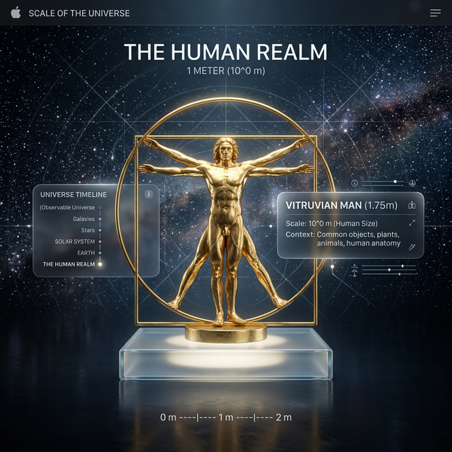
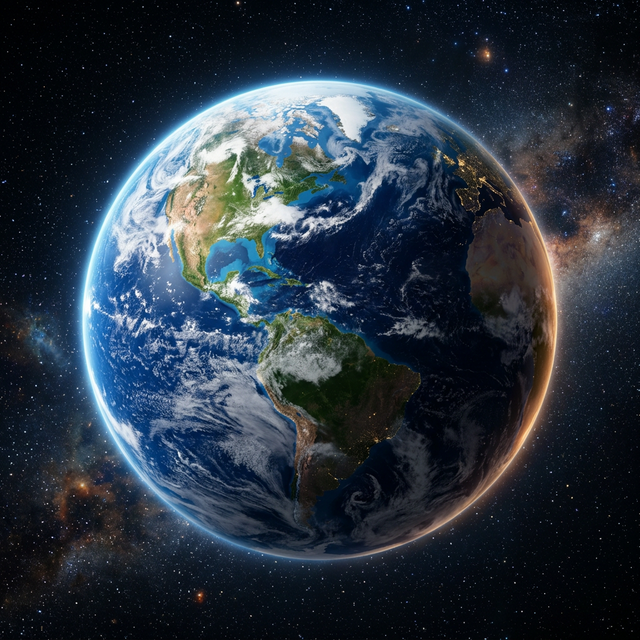
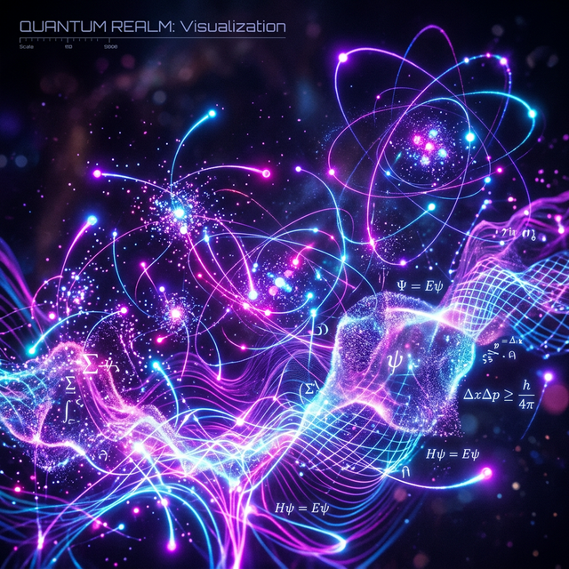

# Scale: A Journey Through the Universe

**Scale** is an immersive SwiftPlaygrounds application that allows users to explore the vastness of the universe, from the infinitesimal quantum realm to the unfathomable reaches of the observable universe. 

Built with **SceneKit** and **SwiftUI**, Scale provides a seamless, high-performance 3D experience with premium Apple-inspired aesthetics.

## Features

- **Logarithmic Zoom**: Fluidly transition across 45+ orders of magnitude with a natural pinch gesture.
- **Procedural Realism**: Stunning 3D models including a Vitruvian-style gold statue, realistic planetary bodies, and abstract quantum visualizations.
- **Dynamic Atmosphere**: Real-time lighting and background shifts that adapt to your current scale.
- **Haptic & Audio Feedback**: Tactile and auditory cues that make the journey feel physical and alive.
- **Premium Design**: Apple-standard glassmorphism, vibrant color palettes, and slick micro-animations.

## Visual Gallery

|||
|---|---|
||

## Technical Details

- **Engine**: Custom `ScaleEngine` managing logarithmic transitions.
- **Graphics**: `SceneKit` with PBR materials, bloom, and HDR rendering.
- **Platform**: Designed for iOS 17.0+ (iPad and iPhone).

## Getting Started

1. Clone this repository.
2. Open `Scale.swiftpm` in **Swift Playgrounds** on iPad or Mac, or in **Xcode**.
3. Hit Play and start your journey!

---
Created by Divyanshu Singh
